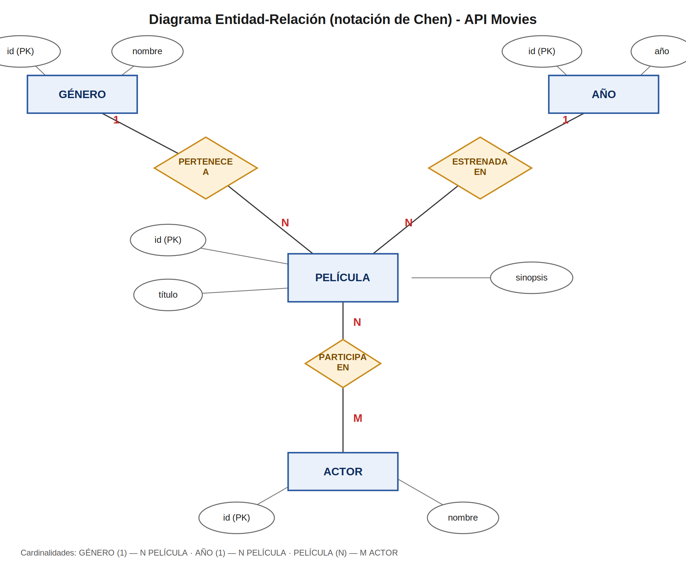
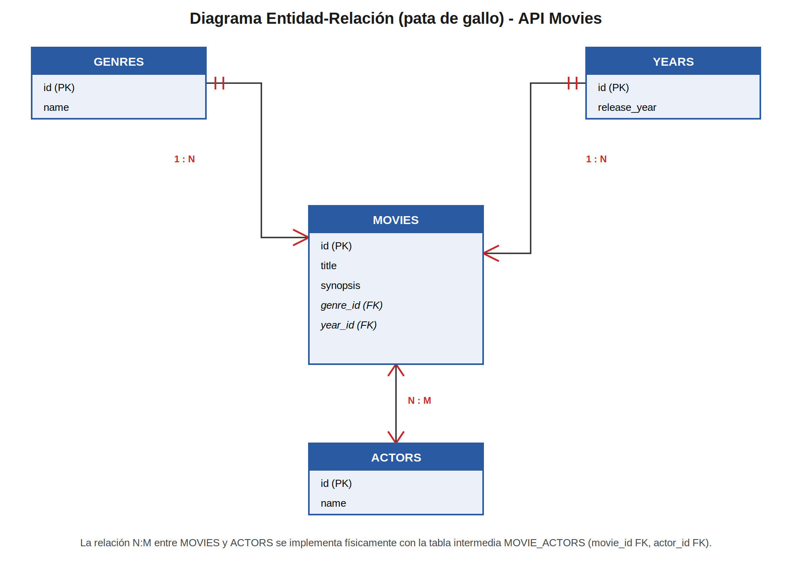
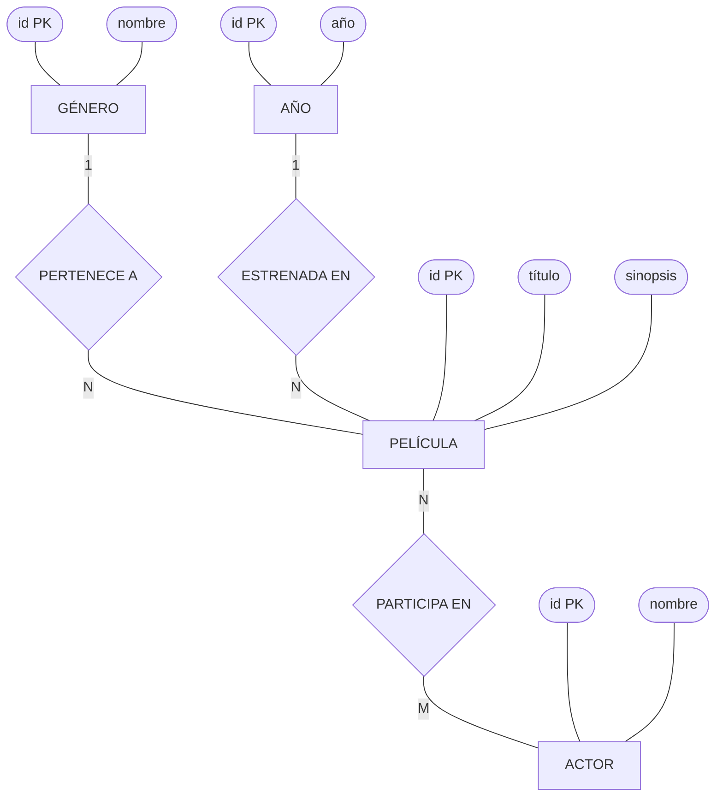
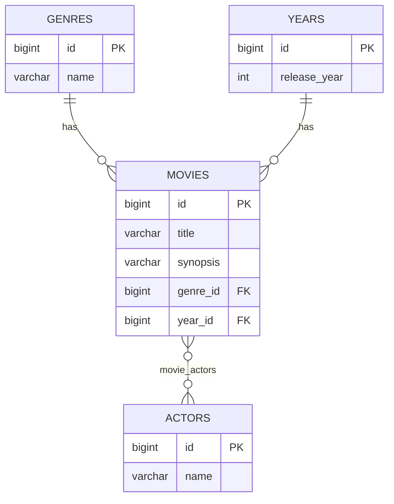
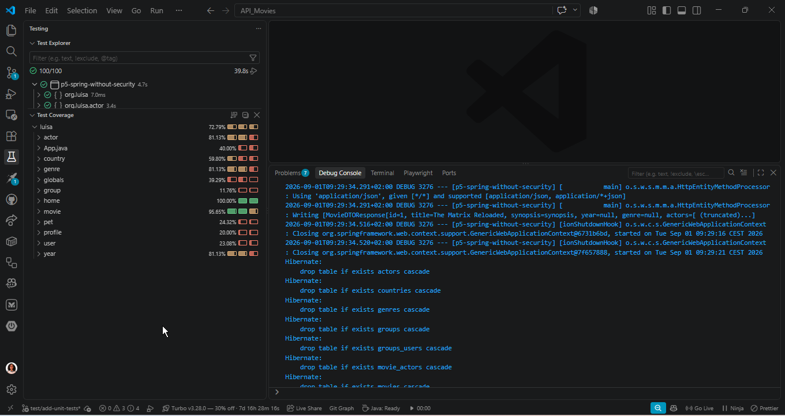

# API Movies

🔗 [Repositorio en GitHub](https://github.com/lcortes89/API_Movies/)

API REST construida con Spring Boot para gestionar un catálogo de películas: cada película tiene un título, una sinopsis, un género, un año de estreno y un reparto de actores. Arquitectura en capas (entity, repository, service, controller), DTOs con `record`, patrón *builder* para las entidades, y manejo de errores centralizado con respuestas JSON estructuradas.

[](https://www.oracle.com/java/technologies/downloads/) [](https://spring.io/projects/spring-boot) [](https://maven.apache.org/) [](https://www.h2database.com/) [](https://www.postman.com/)

<a id="index"></a>

# 📑 Índice

- [📖 Descripción](#description)
- [🚀 Demo](#demo)
- [✨ Funcionalidades](#features)
- [🗺 Diagramas Entidad-Relación](#diagrams)
- [🛠 Tecnologías](#technologies)
- [📦 Pre-requisitos](#prerequisites)
- [⚙ Instalación](#installation)
- [▶ Uso](#usage)
- [🧪 Pruebas rápidas](#testing)
- [✅ Tests unitarios](#unit-tests)
- [📂 Estructura del proyecto](#structure)
- [👩‍💻 Autora](#author)

<a id="description"></a>

## Descripción

API Movies permite gestionar un catálogo de películas: crear, consultar, actualizar y eliminar películas, cada una asociada a un género, un año de estreno y (opcionalmente) uno o varios actores. También expone endpoints propios para gestionar género, año y actor por separado. Los datos se guardan en una base de datos H2 en memoria mientras dura la ejecución.

[↑ Índice](#index) • [Demo →](#demo)

<a id="demo"></a>

## Demo

```bash
# 1. Crear un género
curl -X POST http://localhost:8080/api/v1/genres \
  -H "Content-Type: application/json" \
  -d '{"name":"Sci-Fi"}'
# → 201 Created: {"id":1,"name":"Sci-Fi"}

# 2. Crear un año
curl -X POST http://localhost:8080/api/v1/years \
  -H "Content-Type: application/json" \
  -d '{"releaseYear":1999}'
# → 201 Created: {"id":1,"releaseYear":1999}

# 3. Crear una película usando esos ids
curl -X POST http://localhost:8080/api/v1/movies \
  -H "Content-Type: application/json" \
  -d '{"title":"The Matrix","synopsis":"A hacker discovers his reality is a simulation.","yearId":1,"genreId":1,"actorIds":[]}'
# → 201 Created:
# {
#   "id": 1,
#   "title": "The Matrix",
#   "synopsis": "A hacker discovers his reality is a simulation.",
#   "year": { "id": 1, "releaseYear": 1999 },
#   "genre": { "id": 1, "name": "Sci-Fi" },
#   "actors": []
# }

# 4. Buscar por género
curl "http://localhost:8080/api/v1/movies/search?genre=Sci-Fi"
```

[← Descripción](#description) • [↑ Índice](#index) • [Funcionalidades →](#features)

<a id="features"></a>

## Funcionalidades

- CRUD completo de películas: listar, obtener por id, crear, actualizar y eliminar, con validación en cada campo obligatorio (título, año, género).
- Endpoint adicional para buscar películas por título o por género (`/movies/search`).
- CRUD de género, año y actor (listar, obtener por id, crear, actualizar), reutilizables desde cualquier película.
- Relaciones modeladas con JPA: película–género (N:1), película–año (N:1) y película–actor (N:M, resuelta con una tabla intermedia).
- Comprobación de duplicados al crear/actualizar género, año, actor (por nombre) y película (por título), devolviendo `409 Conflict` en caso de coincidencia.
- DTOs (`record`) independientes de las entidades JPA, con un *mapper* dedicado por entidad.
- Patrón *builder* para construir las entidades de forma legible.
- Manejo de errores centralizado (`@RestControllerAdvice`) con respuesta JSON estructurada (`timestamp`, `status`, `error`, `message`).
- Arquitectura en capas: Entity → Repository → Service (interfaz + implementación) → Controller, siguiendo el principio de Inversión de Dependencias mediante interfaces genéricas compartidas.

[← Demo](#demo) • [↑ Índice](#index) • [Diagramas →](#diagrams)

<a id="diagrams"></a>

## Diagramas Entidad-Relación

Miniaturas — haz clic en cualquiera para ver la imagen completa:

| Diagrama de Chen | Diagrama de pata de gallo (Crow's Foot) |
|:---:|:---:|
| [](docs/diagrams/diagram_chen.png) | [](docs/diagrams/crows_foot_diagram.png) |

<details>
<summary>Ver versión Mermaid (se renderiza directamente en GitHub)</summary>

**Notación de Chen:**



**Notación de pata de gallo:**



</details>

[← Funcionalidades](#features) • [↑ Índice](#index) • [Tecnologías →](#technologies)

<a id="technologies"></a>

## Tecnologías

-  — Lenguaje de programación usado en el proyecto
-  — Framework para construir la API REST
-  — Gestión de dependencias y build
-  — Base de datos en memoria para desarrollo
-  — Cliente usado para probar manualmente los endpoints
-  — Editor usado para desarrollar el proyecto
-  — Lenguaje de marcado del README
-   — Control de versiones y alojamiento del proyecto

[← Diagramas](#diagrams) • [↑ Índice](#index) • [Pre-requisitos →](#prerequisites)

<a id="prerequisites"></a>

## Pre-requisitos

Antes de clonar y ejecutar el proyecto, necesitas tener instalado:

- [Java 21 (JDK)](https://www.oracle.com/java/technologies/downloads/#java21)
- [Maven 3.6.3 o superior](https://maven.apache.org/download.cgi)
- [Git](https://git-scm.com/downloads)
- [Postman](https://www.postman.com/downloads/) (opcional, para probar los endpoints)

[← Tecnologías](#technologies) • [↑ Índice](#index) • [Instalación →](#installation)

<a id="installation"></a>

## Instalación

```bash
git clone https://github.com/lcortes89/API_Movies.git
cd API_Movies
```

[← Pre-requisitos](#prerequisites) • [↑ Índice](#index) • [Uso →](#usage)

<a id="usage"></a>

## Uso

```bash
./mvnw spring-boot:run
```

La API queda disponible en `http://localhost:8080/api/v1`. Con el perfil `h2` activo, `data.sql` carga automáticamente algunos datos de ejemplo al arrancar.

[← Instalación](#installation) • [↑ Índice](#index) • [Pruebas rápidas →](#testing)

<a id="testing"></a>

## Pruebas rápidas

```bash
curl http://localhost:8080/api/v1/movies
curl http://localhost:8080/api/v1/movies/1
curl -X DELETE http://localhost:8080/api/v1/movies/1
curl "http://localhost:8080/api/v1/movies/search?genre=Sci-Fi"
```

También puedes importar estas peticiones en Postman manualmente, siguiendo los ejemplos de la sección [Demo](#demo).

[← Uso](#usage) • [↑ Índice](#index) • [Tests unitarios →](#unit-tests)

<a id="unit-tests"></a>

## Tests unitarios

Se desarrollaron tests unitarios para las 4 entidades principales (`Genre`, `Year`, `Actor`, `Movie`), cubriendo Entity, Service, Controller y Mapper, siguiendo el mismo estilo enseñado en clase con `Country`. Se usa JUnit 5, Mockito (para simular los repositorios sin tocar una base de datos real) y MockMvc (para simular peticiones HTTP a los controllers).

```bash
./mvnw test
```

**Resultado: 79 tests, 0 fallos.**



[← Pruebas rápidas](#testing) • [↑ Índice](#index) • [Estructura del proyecto →](#structure)

<a id="structure"></a>

## Estructura del proyecto

```
API_MOVIES/
├── pom.xml
├── README.md
├── docs/
│   └── diagrams/
│       ├── diagram_chen.png
│       └── crows_foot_diagram.png
├── src/
│   ├── main/
│   │   ├── java/org/luisa/
│   │   │   ├── App.java
│   │   │   ├── globals/
│   │   │   │   ├── ApiException.java
│   │   │   │   └── GlobaExceptionHandler.java
│   │   │   ├── implementations/
│   │   │   │   ├── InterfaceGenericGetService.java
│   │   │   │   └── InterfaceGenericeEditService.java
│   │   │   ├── genre/
│   │   │   │   ├── GenreEntity.java, GenreRepository.java
│   │   │   │   ├── InterfaceGenreService.java, GenreServiceImpl.java, GenreController.java
│   │   │   │   ├── builder/, dtos/, mappers/, exceptions/
│   │   │   │   └── ...
│   │   │   ├── year/           (misma estructura)
│   │   │   ├── actor/          (misma estructura)
│   │   │   └── movie/
│   │   │       ├── MovieEntity.java, MovieRepository.java
│   │   │       ├── InterfaceMovieService.java, MovieServiceImpl.java, MovieController.java
│   │   │       └── builder/, dtos/, mappers/, exceptions/
│   │   └── resources/
│   │       ├── application.properties
│   │       ├── application-h2.properties
│   │       └── data.sql
│   └── test/java/org/luisa/
└── target/
```

[← Tests unitarios](#unit-tests) • [↑ Índice](#index) • [Autora →](#author)

<a id="author"></a>

## Autora

**[Luisa Cortés](https://github.com/lcortes89)**

[← Estructura del proyecto](#structure) • [↑ Índice](#index)